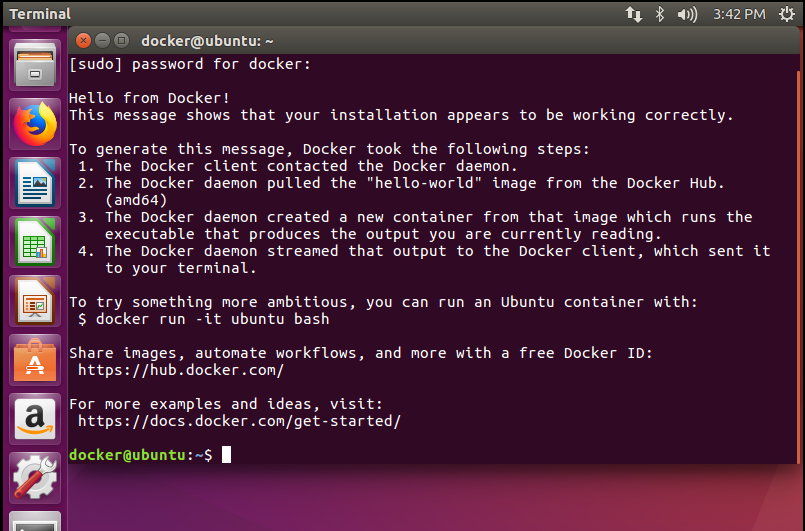

## Docker核心概念

  docker大部分的操作都围绕它的三大核心概念：镜像、容器和仓库 。因此准确把握这三大核心概念尤为重要。

### 1.Docker镜像
  
  Docker镜像可以类似于虚拟机镜像，可以理解它为一个类似于只可读的模板。

  镜像是创建Docker容器的基础
  
  利用版本管理和增量文件系统，Docke提供可一套是否简单的机制来创建和更新现有的镜像。甚至直接可以直接从网上直接复制一个现场做好的镜像，并直接使用。


### 2.Docker容器

   Docker容器相当于一个轻量级沙箱，Docker利用容器来运行和隔离应用。

   容器是从镜像创建的应用来运行实例的。它可以启动、开始、停止、删除，而这些容器之间是相互隔离的、不可见的。

   注：镜像只是可读的，容器在镜像上启动时，只是在镜像的最上层增加了一个可写层。


### 3.Docker仓库

   Docker类似于存放代码的仓库，只不过它是存放各类镜像的仓库。

   有时候我们会把Docker仓库和仓库注册服务器（Registry）混为一谈，其中Docker仓库是存放镜像用的，而Registry是存放仓库的地方。

   根据仓库是否公开共享，Docker分为公有仓库和私有仓库。


## 安装Docker

  用户可以通过如下命令检查自己的内核版本详细信息：
    
  ```
  $ uname -a
  Linux ubuntu 4.15.0-43-generic #46~16.04.1-Ubuntu SMP Fri Dec 7 13:31:08 UTC 2018 x86_64 x
  86_64 x86_64 GNU/Linux
  ```
  

* 安装所需要的包

  因为使用的是Ubuntu 16.04LTS版本，为了让Docker使用aufs（Docker 存储可以分为分层文件系统和卷,AUFS 分层文件系统。参考：[aufs]:       https://www.cnblogs.com/sammyliu/p/5931383.html

  推荐安装如下两个安装包
  ```
  $ sudo apt-get update
  $ sudo apt-get install linux-image-extra-$(uname -r) \
   linux-image-extra-virtual
  ```

  在执行上述命令时速度较慢换为阿里云镜像，出现如下错误：

  ```
  E: Unable to locate package linux-image-extra-4.15.0-29-generic
  E: Couldn't find any package by glob 'linux-image-extra-4.15.0-29-generic' 
  E: Couldn't find any package by regex 'linux-image-extra-4.15.0-29-generic'
  ```
  
  查阅相关资料

  linux-image-generic应该已经安装了相关的linux-image-extra包，但名称已更改为linux-modules-extra。试升级到最新的内核：

  ```
  $ sudo apt update
  $ sudo apt upgrade
  $ sudo apt install --reinstall linux-image-generic
  ```

  然后，重新启动并尝试使用以下命令：

  ```
  $ sudo apt install linux-modules-extra-$(uname -r) linux-image-extra-virtual 
  ```

  成功


* 添加使用 HTTPS 传输的软件包以及 CA 证书

  ```
  $ sudo apt-get update
  $ sudo apt-get install \
    apt-transport-https \
    ca-certificates \
    curl \
    software-properties-common
  ```

* 添加Docker的官方GPG key，并验证该key是否安装成功

  ```
  $ curl -fsSL https://download.docker.com/linux/ubuntu/gpg | sudo apt-key add -
  $ sudo apt-key fingerprint 0EBFCD88
  ```

* amd64位机器上使用如下命令来建立稳定的库
  ```
  $ sudo add-apt-repository \
   "deb [arch=amd64] https://download.docker.com/linux/ubuntu \
   $(lsb_release -cs) \
   stable"
  ```


* 安装docker CE
  ```
  $ sudo apt-get update
  $ sudo apt-get install docker-ce
  ```

* 运行hello-world image来验证是否安装成功
  ```
  $ sudo docker run hello-world
  ```

 注意：如果运行成功则网络无问题，若有，则需要配置docker代理,配置完重新运行“$ sudo docker run hello-world”进行验证

  运行结果：
  ```
  :~$ sudo docker run hello-world
  Unable to find image 'hello-world:latest' locally
  docker: Error response from daemon: Get https://registry-1.docker.io/v2/: write tcp 10.11.66.20:49182->50.17.62.194:443: write: connection reset by peer.
  See 'docker run --help'.
  ```
  


## 配置Docker代理

* 1.默认情况下这个配置文件夹并不存在，我们要创建它
  ```
  $ mkdir -p /etc/systemd/system/docker.service.d
  ```

* 2.创建一个文件 /etc/systemd/system/docker.service.d/http-proxy.conf 文件内容如下：
  ```
  [Service]
  Environment="HTTP_PROXY=http://proxy_ip:proxy_port/"
  Environment="HTTPS_PROXY=http://proxy_ip:proxy_port/"
  Environment="NO_PROXY=localhost,127.0.0.1,localaddress,.localdomain.com"
  ```

* 3.刷新systemd配置: 
  ```
  $ sudo systemctl daemon-reload
  ```
* 4.用系统命令验证环境变量加上去没:
  ```
  $ systemctl show --property=Environment docker
  ```
* 5.重启docker
  ```
  $ sudo systemctl restart docker
  ```
* 运行hello-world image来验证是否安装成功
  ```
  $ sudo docker run hello-world
  ```

  运行结果如下

  

注：在国内可能被墙，所以需要配置代理，在国外不需要设置代理，如果在国外设置代理下载镜像时会报以下错误：
```
Using default tag: latest
Error response from daemon: Get https://registry-1.docker.io/v2/: invalid proxy URL port "
proxy_port"
```

如果出现这个错误删掉 /etc/systemd/system/docker.service.d/http-proxy.conf 的这个文件，正常下载镜像。
当时sudo docker run hello-world出现错误时，应该是我这边网络不好，导致sudo docker run hello-world失败。
  
